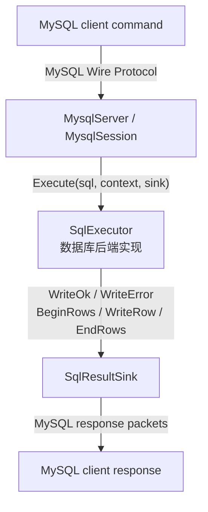

# mysql-wire-cpp

这是一个用 C++17 实现的 MySQL Wire Protocol 前端，负责处理客户端连接、MySQL 命令和结果集编码，SQL 执行通过 `SqlExecutor` 接口交给外部数据库引擎。

## 项目由来

[BusTub](https://github.com/cmu-db/bustub) 是 Carnegie Mellon University 15-445/645 数据库课程使用的教学数据库。完成课程项目后，为了让它不再只能通过自带的 shell 在本地运行，于是为它增加了一个 MySQL 协议前端，让标准 MySQL 客户端也能连接 BusTub 并执行查询。

BusTub 明确要求课程项目实现不得公开，因此完整的 BusTub 仓库仍保持私有。本项目把接入代码中与 BusTub 课程实现无关的部分拆成了这个仓库，包括连接处理、协议握手、命令分发和结果集编码。

协议实现主要参考 [MySQL 8.0.46 Client/Server Protocol](https://dev.mysql.com/doc/dev/mysql-server/8.0.46/)，各个 packet 和 command 对应的文档链接放在源码实现旁。

BusTub 侧只保留一个 adapter，把执行结果写入本项目定义的 `SqlResultSink`。本仓库不包含 BusTub 的课程实现，也不实现 SQL parser、optimizer、execution engine 或 storage engine。

## 设计

协议层通过 `SqlExecutor` 和 `SqlResultSink` 与数据库内核连接：



`mysql-wire-cpp` 负责：

- TCP listener 和每连接一个 session；
- MySQL handshake、packet framing 和 command dispatch；
- OK、ERR 和 text resultset 编码；
- connection ID、当前 database 等连接状态。

数据库后端负责：

- 解析并执行 SQL；
- 提供结果列和结果行；
- 产生结果后通过 sink 写出响应。

公开接口集中在 `include/mysql_wire/mysql_wire.h`。数据库后端实现 `SqlExecutor`：

```cpp
class SqlExecutor {
public:
  virtual ~SqlExecutor() = default;

  virtual auto Execute(const std::string &sql, SqlResultSink &sink) -> bool = 0;

  virtual auto DatabaseName() const -> std::string = 0;
};
```

一条 SQL 只能产生下面三种响应之一：

```text
没有结果行：WriteOk(affected_rows)

执行失败：  WriteError(message)

返回结果行：BeginRows(columns)
                 ↓
             WriteRow(row 1)
                 ↓
             WriteRow(row 2)
                 ↓
             EndRows()
```

`SqlResultSink` 支持逐行流式输出：收到一行就立即编码并发送，协议层不保存完整结果集。sink 方法返回 `false` 表示响应无法继续写入，后端应停止产生结果。

## 实现范围

当前实现覆盖从客户端连接到返回查询结果的基本链路：完成握手后接收 SQL，通过 `SqlExecutor` 交给后端执行，再经 `SqlResultSink` 逐行返回文本结果集。协议层还处理 ping、退出、OK 和错误响应。

它不是完整的 MySQL Server：不负责用户认证、权限和 TLS，不支持 prepared statement、binary protocol 或 payload length 为 `0xFFFFFF` 的 continuation packet，单个 payload 最大为 `0xFFFFFE` 字节，也不提供连接治理和优雅停机。

## 在 Ubuntu 上运行 demo

以下命令已在 WSL2 的 Ubuntu 24.04 环境中验证，使用 GCC 13.3、CMake 3.28 和 MySQL client 8.0.46。这里只需要安装 MySQL 客户端，不需要安装或启动 MySQL Server，demo 本身会监听 MySQL 协议端口。

### 1. 安装依赖

```bash
sudo apt update
sudo apt install build-essential cmake mysql-client
```

确认客户端已经安装：

```bash
mysql --version
```

本机输出：

```text
mysql  Ver 8.0.46-0ubuntu0.24.04.3 for Linux on x86_64 ((Ubuntu))
```

### 2. 获取并构建项目

```bash
git clone https://github.com/yuedongcun/mysql-wire-cpp.git
cd mysql-wire-cpp

cmake -S . -B build -DCMAKE_BUILD_TYPE=Debug
cmake --build build --parallel
```

### 3. 运行测试

```bash
ctest --test-dir build --output-on-failure
```

测试结果：

```text
Test project .../mysql-wire-cpp/build
    Start 1: mysql_wire_handshake_test
1/3 Test #1: mysql_wire_handshake_test ........   Passed
    Start 2: mysql_wire_packet_test
2/3 Test #2: mysql_wire_packet_test ...........   Passed
    Start 3: mysql_wire_session_test
3/3 Test #3: mysql_wire_session_test ..........   Passed

100% tests passed, 0 tests failed out of 3
```

### 4. 启动 demo server

在第一个终端运行：

```bash
./build/mysql-wire-demo --host 127.0.0.1 --port 3307
```

启动输出：

```text
Starting MySQL frontend on 127.0.0.1:3307
mysql-wire-cpp frontend listening on 127.0.0.1:3307
```

`ServeForever()` 会阻塞并持续接受连接，使用 `Ctrl-C` 结束 demo。

### 5. 使用 MySQL 客户端查询

保持 demo server 运行，在第二个终端执行：

```bash
mysql \
  --protocol=tcp \
  --host=127.0.0.1 \
  --port=3307 \
  --user=root \
  --database=demo \
  --ssl-mode=DISABLED \
  --table \
  -e "SELECT 1; SELECT 'hello'; SELECT DATABASE(); SELECT CONNECTION_ID();"
```

查询输出：

```text
+---+
| 1 |
+---+
| 1 |
+---+
+-------+
| hello |
+-------+
| hello |
+-------+
+------------+
| database() |
+------------+
| demo       |
+------------+
+-----------------+
| connection_id() |
+-----------------+
| 1               |
+-----------------+
```

`connection_id()` 从 1 开始，每建立一个新连接都会递增，因此多次运行时数字可能不同。`SELECT DATABASE()` 和 `SELECT CONNECTION_ID()` 由协议前端处理；`SELECT 1` 和 `SELECT 'hello'` 交给 demo executor 处理。

## 接入 SQL 引擎

一个最小后端可以这样返回结果：

```cpp
#include "mysql_wire/mysql_wire.h"

class EngineExecutor final : public mysql_wire::SqlExecutor {
public:
  auto Execute(const std::string &sql, mysql_wire::SqlResultSink &sink)
      -> bool override {
    std::vector<mysql_wire::SqlColumn> columns{
        {"id", mysql_wire::ColumnType::LONGLONG, false},
        {"name", mysql_wire::ColumnType::VAR_STRING, true},
    };
    mysql_wire::SqlRow row{"1", "Alice"};

    return sink.BeginRows(columns) && sink.WriteRow(row) && sink.EndRows();
  }

  auto DatabaseName() const -> std::string override { return "demo"; }
};
```

然后把 executor 交给 server：

```cpp
auto executor = std::make_shared<EngineExecutor>();
mysql_wire::MysqlServer server("127.0.0.1", 3307,
                               std::move(executor));
return server.ServeForever();
```

同一个 executor 会被多个连接共享，因此后端需要处理并发调用。

BusTub 的私有 adapter 把 BusTub 的结果转换成 `SqlResultSink` 调用。依赖方向是 `BusTub -> mysql-wire-cpp`，本仓库不引用 BusTub 类型。

## 安全说明

本项目用于协议学习和数据库前端原型，不是生产级 MySQL Server。它会解析握手中的用户名和认证响应，但不会验证凭证，也不支持 TLS。任何能够连接监听端口的客户端都可以调用后端 `SqlExecutor`。

demo 默认只监听 `127.0.0.1`。不要把当前实现直接暴露到公网，也不要连接包含敏感数据的后端。

## License

项目采用 MIT License。部分代码由 BusTub 演化而来，并保留原有版权声明。
